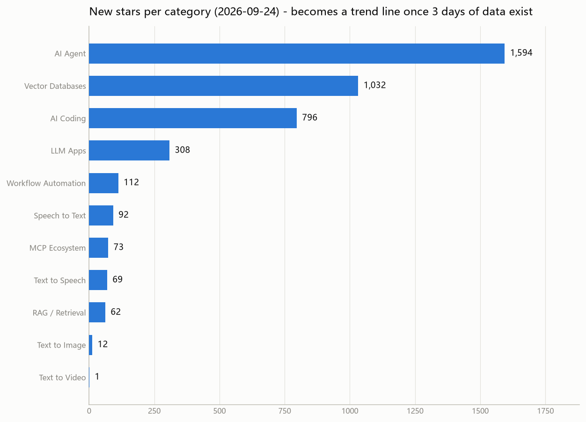

# tool-radar

[简体中文](README.zh-CN.md) · **English**

Tracks category-level momentum in overseas tools. Runs daily and accumulates the deltas.

**The core idea: a single ranking means nothing — the change is the signal.** So it snapshots
every run, diffs against the previous one, and reports what's climbing and what's new.



> The chart above is redrawn daily by `chart.py`, which picks its form based on how much
> history exists:
>
> | Days collected | Chart |
> |---|---|
> | 1 | bars: median stars per category (no baseline yet) |
> | 2 | bars: new stars gained that day |
> | **3+** | **small-multiples line chart — one panel per category** |
>
> A line needs 2 diff points, and the first day has no baseline to diff against — so
> day 3 is the earliest a trend line can exist. Day 2 falls back to a bar chart of that
> day's gains, which is already the real signal, just without a second point to show change.
>
> Why one panel per category instead of 11 colored lines on one chart: a categorical
> palette can only safely carry 8 hues — from the 9th onward, colors become
> indistinguishable under color-vision deficiency. Faceting gives each panel a single
> line, so no legend is needed and nothing gets confused.
> The underlying numbers are also saved to `reports/trend.csv`.

## Data sources

| Source | Question it answers | Token |
|---|---|---|
| GitHub Search API | Which category is climbing? | Optional (raises rate limit 3x) |
| Product Hunt | What closed-source launches are appearing? (invisible on GitHub) | **Required**, free |
| Show HN | Who's shipping new tools? | No |
| Hacker News (Algolia) | Discussion volume — early signal | No |

All are official free APIs. **No scrapers**, so nothing breaks when a site redesigns.

Each source answers a different question — don't read just one:

- **GitHub** shows what the developer community is building — but open-source heat ≠ market demand
- **Show HN** is a "I built a thing" launch feed — the most direct competitor radar
- **Product Hunt** covers the closed-source SaaS blind spot and reveals how fast a category is expanding
- **HN discussion** tends to lead the other metrics — it's early signal

## Local credentials

Put credentials in a `.env` file at the project root (already in `.gitignore`, never committed):

```bash
cp .env.example .env   # or just write one by hand
# then edit .env and fill it in
```

`collect.py` reads it automatically on startup. Existing environment variables take
precedence, so secrets injected by CI always override the local file without any code change.

**Getting a Product Hunt token**: sign in at producthunt.com, open
<https://api.producthunt.com/v2/oauth/applications> → Add application
(name and redirect URL can be anything) → copy the **Developer Token**
(not the Client Secret — they're different).

It runs fine without a PH token; that source just gets skipped without affecting the rest.

## Quick start

```bash
cd tool-radar

python collect.py                 # collect + generate report
python collect.py --only "MCP"    # debug: only categories matching "MCP"
python collect.py --report-only   # offline: regenerate report from last snapshot
python chart.py                   # redraw both charts (Chinese + English)
python chart.py --lang en         # English chart only
```

Charting needs matplotlib, which is **optional**:

```bash
pip install matplotlib
```

Collection works fine without it — `chart.py` prints a notice and exits.

`--only` is a **read-only debug mode**: it writes nothing to `data/`, doesn't touch the
snapshot, and saves its report as `reports/DATE.debug.md`. Because `append_history`
replaces by date wholesale, running `--only` for real would wipe the other categories'
data for that day — so it simply isn't allowed to write.

With a GitHub token (raises the search rate limit from 10/min to 30/min):

```bash
GITHUB_TOKEN=ghp_xxx python collect.py
```

## Output

```
data/history.csv          Long-format history: one row per day/category/project. Pivot it however you like.
data/latest.json          Last snapshot, used for diffing
reports/YYYY-MM-DD.md     Human-readable daily report
reports/trend.en.png      Trend chart (English), referenced by this README
reports/trend.zh.png      Trend chart (Chinese), referenced by README.zh-CN.md
reports/trend.csv         The chart's numbers in table form
```

`history.csv` uses a `source` column (`github` / `producthunt` / `showhn`) so all three
sources share one table — a single query can cover both open-source projects and
closed-source launches.

**How to read the report, in order of value:**

1. **Star movers** — change since last run. The most important signal: fast growth = rising demand
2. **Recently created** — projects created within 180 days. Where new entrants show up, most opportunity
3. **New entrants** — absent last time, present now
4. **Product Hunt top-voted** — highest-voted closed-source launches of the last 30 days (demand side)
5. **Show HN** — new tool launches from the past 7 days. The most direct competitor radar
6. **New Hacker News discussions** — early signal, usually ahead of the other data
7. **Per-category detail** — the full lists, for lookup

## Configuration

Everything lives in `config.json`. Edit it and it takes effect immediately — no code changes.

```json
{
  "defaults": {
    "min_stars": 100,
    "limit": 25,
    "active_within_days": 0,
    "recent_days": 180,
    "hn_days": 30,
    "hn_limit": 10
  },
  "show_hn": {
    "days": 7,
    "limit": 40,
    "min_points": 3
  },
  "producthunt": {
    "days": 30,
    "limit": 20
  },
  "categories": {
    "文生图": {
      "en": "Text to Image",
      "github": "\"text to image\" in:name,description",
      "hn": "text to image"
    }
  }
}
```

Category keys are in Chinese — that's the language the daily report is written in.
`en` supplies the English label used by the English chart; if you omit it, the Chinese
name is used there instead.

`show_hn` and `producthunt` are **global sources**, not split by category — which track a
new product belongs to is obvious from its title and tagline.

| Field | Meaning |
|---|---|
| `en` | English label for the chart. Falls back to the Chinese key if absent |
| `github` | GitHub search syntax, spliced straight into the API's `q` |
| `hn` | Hacker News keyword; leave empty to skip HN for this category |
| `min_stars` | Star floor, filters out noise |
| `limit` | How many entries per category |
| `active_within_days` | Only projects pushed within N days (0 = no limit) |
| `recent_days` | Time window for the "recently created" section |

### Adding a category

Add one entry to `categories`:

```json
"AI Education": {
  "github": "\"ai tutor\" in:name,description",
  "hn": "AI tutor"
}
```

## Gotchas

Everything here is an empirical finding. Worth reading before changing the config.

### Don't use `topic:` queries

GitHub topics are user-applied tags, and popular projects tag themselves with every
trending topic for exposure. Measured:

```
topic:vector-database  →  anything-llm, llama_index   (not vector databases)
topic:mcp              →  n8n, JavaGuide, dify        (just tagged)
```

The result: every category's leaderboard is occupied by the same handful of giants, and
the signal is completely diluted.

**Phrase search is far cleaner:**

```
"model context protocol" in:name,description   →  all genuine MCP projects
"vector database" in:name,description          →  milvus / qdrant / weaviate
```

Qualifiers: `in:name`, `in:description`, `in:readme`, `in:topics`
Filters: `stars:>100`, `pushed:>2026-01-01`, `language:python`

### Product Hunt must be sorted by votes, not time

`order: NEWEST` and `RANKING` both return posts published hours ago whose **vote count is
always 0** — no signal at all. You must use `order: VOTES`, which returns the
highest-voted recent posts (measured: spanning roughly three weeks).

Also measured: `first` above 20 has no effect — the server returns 20 anyway. So you
can't get more per run; you accumulate by running daily.

### The PH API disconnects intermittently from some networks

Measured: roughly **1 in 3 requests** dies at the TLS layer
(`SSL: UNEXPECTED_EOF_WHILE_READING`), but a retry gets through. `_ph_post` therefore
carries 4 backoff retries. Note this is not DNS-level blocking — `curl` over the same
network succeeds.

## Deploying to GitHub Actions (recommended)

Free, and no machine of yours needs to stay on.

1. Create a repo on GitHub (public is unlimited-free; private gets 2,000 minutes/month
   and this job uses about 1 minute a day)
2. Push the contents of `tool-radar/`
3. Under **Settings → Secrets and variables → Actions → Repository secrets**, add
   `PH_API_TOKEN` (it must be a *Repository* secret, not an *Environment* secret — the
   latter only gets injected if the workflow declares `environment:`)
4. Go to the Actions tab and trigger `采集品类热度` manually once to verify
5. After that it runs daily at 01:17 UTC and commits results back to the repo

`GITHUB_TOKEN` is built into Actions — no setup needed.

**Local scheduling** (if you'd rather not use GitHub): Windows Task Scheduler or Linux
cron running `python collect.py`. Your machine has to stay on.

### ⚠️ Never let local and Actions write data at the same time

This one was hit for real.

`data/` and `reports/` are generated artifacts, and **both a local run and an Actions run
modify them**. If both get committed and then merged, Git **concatenates** the two
appends — `history.csv` simply doubles, and **there is no conflict warning**, because
both sides "appended at the end of the file," which Git treats as non-conflicting.

(`git merge -X ours` doesn't help either — it only applies to conflicting hunks, and this
silent concatenation isn't one.)

**The rule: let Actions be the only data writer.**

Run locally only for debugging, and **commit code only, never data**:

```bash
git add collect.py chart.py config.json README.md README.zh-CN.md .gitattributes .github/
git commit -m "what changed"
git push          # note: no data/ or reports/
```

If you really do need to push locally collected data, `git pull` first and take the
remote's data back:

```bash
git pull
git checkout origin/main -- data/ reports/
# confirm there are no duplicate rows before committing
```

Checking for duplicate rows:

```bash
python -c "import csv,collections; rows=list(csv.DictReader(open('data/history.csv',encoding='utf-8'))); print(collections.Counter(r['date'] for r in rows))"
```

Normally you'll see one entry per day. Note: **don't parse this with `cut -d,`** — when a
field contains commas (Product Hunt topics, for instance) the columns shift. Use a real
CSV parser.

## Known limitations

- **Open source plus Product Hunt only.** GitHub can't see closed-source SaaS; PH covers
  part of that gap, but together they still aren't the whole picture
- **No baseline on first run** — the movers table is empty. It only becomes meaningful
  on the second run
- **Unauthenticated GitHub search is 10 requests/min**, so 11 categories will hit the
  limit. There's backoff-and-retry built in and it recovers on its own, just slower.
  A token makes this a non-issue
- HN coverage is thin for niche categories (MCP might yield a single hit on a given day)
- **The trend chart needs time.** A line needs 2 diff points, which needs 3 days of
  collection. Before that it falls back to a bar chart

## Possible additions

In rough order of value-for-effort:

1. **AI tool directories** (toolify / futurepedia / theresanaiforthat) — a complete
   category map, but requires a scraper that breaks whenever they redesign
2. **Google Trends** — answers "is demand rising or falling". `pytrends` is free but rate-limited
3. **Reddit** — has an API; vertical community discussion and real complaints
4. **Push notifications** — alert to WeChat (ServerChan) or email when the movers table
   spikes. **Probably the most valuable item here** — a report sitting in a repo is one
   you won't check daily
