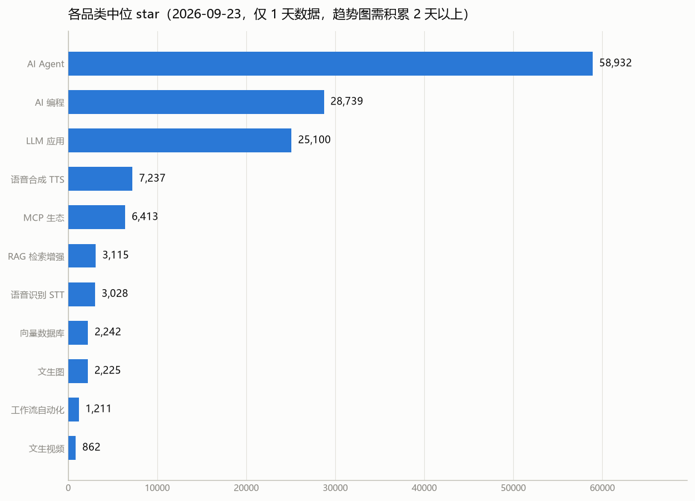

# tool-radar

**简体中文** · [English](README.md)

海外工具品类热度采集。每天自动跑，把变化量攒下来。

**核心思路：单次排名没有意义，变化量才是信号。** 所以它每次都存快照，和上一次对比，输出「谁在涨、谁是新来的」。



> 上图由 `chart.py` 每天自动重画。**数据攒到 2 天以上会自动从柱状图切换成小倍数折线趋势图。**
>
> 为什么用一格一个品类，而不是一张图 11 条彩线：分类色最多只能安全地用 8 个，
> 第 9 个开始颜色在色觉障碍下就分不开了。分面之后每格只有一条线，不需要图例，也不会混淆。
> 图上的原始数值同时存一份在 `reports/trend.csv`。

## 数据源

| 源 | 回答什么问题 | 需要 token |
|---|---|---|
| GitHub Search API | 哪个品类在涨？ | 可选（有 token 限额高 3 倍） |
| Product Hunt | 闭源新品在冒什么？（GitHub 看不到） | **需要**，免费 |
| Show HN | 谁在发布新工具？ | 不需要 |
| Hacker News (Algolia) | 讨论热度，早期声量 | 不需要 |

都是官方免费接口，**没有爬虫**，不会因为对方改版而挂掉。

四个源在报告里回答的是不同问题，不要只看一个：

- **GitHub** 告诉你开发者社区在做什么 —— 但开源热度 ≠ 市场需求
- **Show HN** 是「我做了个东西」的发布会，最直接的竞品雷达
- **Product Hunt** 补上闭源 SaaS 的盲区，能看出一个品类的扩张速度
- **HN 讨论** 通常领先于其他指标，是早期声量

## 本地配置密钥

密钥放项目根目录的 `.env` 文件里（已在 `.gitignore`，不会被提交）：

```bash
cp .env.example .env   # 或者直接手写一个
# 然后编辑 .env，填进去
```

`collect.py` 启动时会自动读它。已存在的环境变量优先，所以 CI 里注入的
secrets 永远盖过本地文件，不用改代码。

**Product Hunt token 怎么拿**：登录 producthunt.com 后打开
<https://api.producthunt.com/v2/oauth/applications> → Add application
（名字和 redirect URL 随便填）→ 复制页面上的 **Developer Token**
（不是 Client Secret，两个不一样）。

没有 PH token 也能跑，那一段会自动跳过，不影响其他采集。

## 快速开始

```bash
cd tool-radar

python collect.py                 # 采集 + 出报告
python collect.py --only "MCP"    # 调试：只采名字含 "MCP" 的品类
python collect.py --report-only   # 不联网，用上次快照重出报告
python chart.py                   # 从历史重画趋势图（中英两张）
python chart.py --lang en         # 只出英文图
```

画图依赖 matplotlib，是**可选**的：

```bash
pip install matplotlib
```

没装也能正常采集 —— `chart.py` 会提示一句然后退出，不影响其他流程。

`--only` 是**只读调试模式**：它不写 `data/`、不写快照，报告也另存为
`reports/日期.debug.md`。因为 `append_history` 是按日期整体替换的，
用 `--only` 正式跑会把当天其他品类的数据一起抹掉 —— 所以干脆不让它写。

有 GitHub token 的话（限额从 10 次/分 提到 30 次/分）：

```bash
GITHUB_TOKEN=ghp_xxx python collect.py
```

## 输出

```
data/history.csv          长表历史，每行 = 某天某品类某项目，以后可以随便透视
data/latest.json          最近一次快照，用于做 diff
reports/YYYY-MM-DD.md     人类可读的日报
reports/trend.zh.png      趋势图（中文），本文件引用
reports/trend.en.png      趋势图（英文），README.md 引用
reports/trend.csv         趋势图的数值版（图看不出来时查这个）
```

`history.csv` 用 `source` 列区分来源（`github` / `producthunt` / `showhn`），
三个源共用一张表，可以用一条查询同时看开源项目和闭源新品的走势。

**报告怎么读，按价值排序：**

1. **star 增速榜** — 对比上次涨了多少。这是最核心的信号，涨得快 = 需求在起
2. **近期新建** — 180 天内创建的项目。新玩家进场的地方，机会最多
3. **新进入榜** — 上次没出现、这次冒出来的
4. **Product Hunt 高票榜** — 近 30 天票数最高的闭源新品，看需求端
5. **Show HN** — 近 7 天的新工具发布，最直接的竞品雷达
6. **Hacker News 新讨论** — 早期声量，通常领先于其他数据
7. **各品类明细** — 完整列表，用来查

## 配置

全在 `config.json`，改完直接生效，不用动代码。

```json
{
  "defaults": {
    "min_stars": 100,
    "limit": 25,
    "active_within_days": 0,
    "recent_days": 180,
    "hn_days": 30,
    "hn_limit": 10
  },
  "show_hn": {
    "days": 7,
    "limit": 40,
    "min_points": 3
  },
  "producthunt": {
    "days": 30,
    "limit": 20
  },
  "categories": {
    "文生图": {
      "en": "Text to Image",
      "github": "\"text to image\" in:name,description",
      "hn": "text to image"
    }
  }
}
```

品类名用中文，因为日报是中文的。`en` 是给英文版图表用的标签 ——
不填就退回中文名。

`show_hn` 和 `producthunt` 是**全局源**，不按品类拆 —— 新品属于哪个赛道，看标题和 tagline 就知道了。

| 字段 | 含义 |
|---|---|
| `en` | 图表上的英文标签。不填则退回中文名 |
| `github` | GitHub 搜索语法，直接拼进 API 的 `q` |
| `hn` | Hacker News 关键词，留空则跳过 HN |
| `min_stars` | star 下限，过滤掉噪声项目 |
| `limit` | 每个品类取多少条 |
| `active_within_days` | 只要最近 N 天有提交的（0 = 不限） |
| `recent_days` | 「近期新建」板块的时间窗口 |

### 加一个品类

在 `categories` 里加一条就行：

```json
"AI 教育": {
  "github": "\"ai tutor\" in:name,description",
  "hn": "AI tutor"
}
```

## 踩过的坑

这一节记录的都是实测出来的结论，改配置前建议先看。

### 别用 `topic:` 查询

GitHub topic 是用户自己打的标签，热门项目会把所有热门 topic 都打一遍蹭曝光。实测：

```
topic:vector-database  → 返回 anything-llm、llama_index（不是向量数据库）
topic:mcp              → 返回 n8n、JavaGuide、dify（只是打了 tag）
```

结果就是每个品类的榜单都被同样几个巨头占据，信号全被稀释。

**用短语搜索，干净得多：**

```
"model context protocol" in:name,description   → 全是真 MCP 项目
"vector database" in:name,description          → milvus / qdrant / weaviate
```

可用限定符：`in:name`、`in:description`、`in:readme`、`in:topics`
可用过滤：`stars:>100`、`pushed:>2026-01-01`、`language:python`

### Product Hunt 必须按票数排，不能按时间

`order: NEWEST` / `RANKING` 返回的都是刚发布几小时的帖子，**票数恒为 0**，等于没有热度信号。
必须用 `order: VOTES`，它返回近期票数最高的一批（实测跨约三周）。

另外实测 `first` 超过 20 无效，服务端就返回 20 条，所以靠单次翻页拿不到更多 —— 靠每天跑一次累积。

### 从国内访问 PH 的 API 会间歇性断连

实测约 **1/3 的请求**会在 TLS 层被中断（`SSL: UNEXPECTED_EOF_WHILE_READING`），但重试就能过。
`_ph_post` 因此带了 4 次退避重试。注意这不是 GFW 拦截 —— 同一网络下 curl 是通的。

## 部署到 GitHub Actions（推荐）

不用自己的机器一直开着，免费。

1. 在 GitHub 建个仓库（public 无限免费；private 每月 2000 分钟免费额度，这个任务每天只跑 1 分钟）
2. 把 `tool-radar/` 里的内容 push 上去
3. 在 **Settings → Secrets and variables → Actions → Repository secrets** 里加一个 `PH_API_TOKEN`
   （必须是 Repository secrets，不是 Environment secrets —— 后者需要在 workflow 里声明 `environment:` 才会注入）
4. 进 Actions 页面，手动触发一次 `采集品类热度` 验证
5. 之后每天 UTC 01:17（北京时间 09:17）自动跑，结果自动 commit 回仓库

`GITHUB_TOKEN` 是 Actions 内置的，不用自己配。

**本地定时**（不想用 GitHub）：Windows 任务计划程序 / Linux cron 调
`python collect.py` 即可，但电脑得开着。

### ⚠️ 别让本地和 Actions 同时写数据

这是实际踩过的坑。

`data/` 和 `reports/` 是生成物，**本地跑和 Actions 跑都会改它们**。如果两边都提交再合并，
Git 会把两份追加内容**拼在一起** —— `history.csv` 直接翻倍，而且**不会有冲突提示**，
因为两边都是「在文件末尾追加」，Git 判定为非冲突，静默拼接。

（`git merge -X ours` 也救不了 —— 它只作用于冲突块，而这种静默拼接不算冲突。）

**结论：把 Actions 当唯一的数据写入方。**

本地只在调试时跑，而且**只提交代码，不提交数据**：

```bash
git add collect.py chart.py config.json README.md README.zh-CN.md .gitattributes .github/
git commit -m "改了什么"
git push          # 注意：不含 data/ 和 reports/
```

如果确实要把本地采的数据传上去，先 `git pull`，再把远端数据取回来对一遍：

```bash
git pull
git checkout origin/main -- data/ reports/
# 确认没有重复行之后再提交
```

验证有没有重复行：

```bash
python -c "import csv,collections; rows=list(csv.DictReader(open('data/history.csv',encoding='utf-8'))); print(collections.Counter(r['date'] for r in rows))"
```

正常情况每天一个计数条目。注意**别用 `cut -d,`** 来解析 —— 字段里含逗号时
（比如 Product Hunt 的 topic）列会错位，要用正经的 CSV 解析器。

## 已知限制

- **只有开源项目 + Product Hunt**。GitHub 覆盖不到闭源 SaaS，PH 补上了一部分，但两边合起来仍不是全貌
- **首次运行没有基线**，增速榜是空的。跑第二次才有意义
- **未认证时 GitHub 搜索接口 10 次/分**，11 个品类会触发限流。代码里有退避重试，会自己恢复，但会慢一点。配个 token 更省事
- HN 数据对小众品类覆盖较差（比如 MCP 一天可能只有 1 条）
- **趋势图需要时间**。少于 2 天数据画不出趋势，会降级成柱状图

## 下一步可以加的数据源

按性价比排：

1. **AI 工具导航站**（toolify / futurepedia / theresanaiforthat）— 能拿到完整品类地图，但要写爬虫，对方改版就得修
2. **Google Trends** — 回答「需求在涨还是在退」，`pytrends` 免费但会限流
3. **Reddit** — 有 API，看垂直社区讨论和真实抱怨
4. **定时推送** — 增速榜有异动时推送到微信（Server酱）/ 邮件。**可能是最实用的一条** —— 报告躺在仓库里，不加推送你不会天天去看
